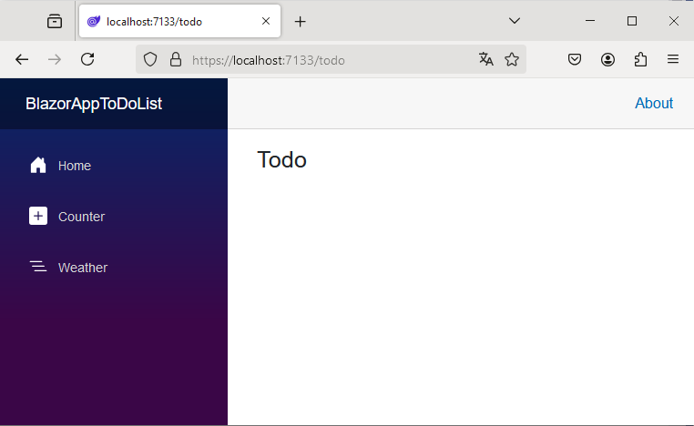
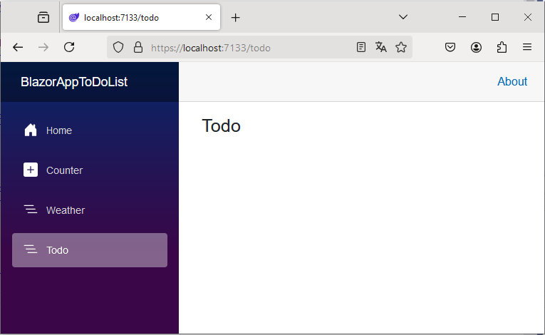

# BlazorAppHelloWorld

Folowing the tutorial at <https://learn.microsoft.com/en-us/training/modules/build-blazor-todo-list/3-exercise-data-binding>

## Repo

```bash
Benny@FLAB2021 MINGW64 /c/DATA/GIT/CSHARP/BlazorAppToDoList
$ git init
Initialized empty Git repository in C:/DATA/GIT/CSHARP/BlazorAppToDoList/.git/

Benny@FLAB2021 MINGW64 /c/DATA/GIT/CSHARP/BlazorAppToDoList (main)
$ git status
On branch main

No commits yet

Untracked files:
  (use "git add <file>..." to include in what will be committed)
        .vs/
        BlazorAppToDoList.sln
        BlazorAppToDoList/
        README.md

nothing added to commit but untracked files present (use "git add" to track)

Benny@FLAB2021 MINGW64 /c/DATA/GIT/CSHARP/BlazorAppToDoList (main)
$ git add .
warning: in the working copy of '.vs/BlazorAppToDoList/config/applicationhost.config', CRLF will be replaced by LF the next time Git touches it
warning: in the working copy of '.vs/BlazorAppToDoList/v17/DocumentLayout.backup.json', CRLF will be replaced by LF the next time Git touches it
warning: in the working copy of '.vs/BlazorAppToDoList/v17/DocumentLayout.json', CRLF will be replaced by LF the next time Git touches it
warning: in the working copy of 'BlazorAppToDoList.sln', CRLF will be replaced by LF the next time Git touches it
warning: in the working copy of 'BlazorAppToDoList/BlazorAppToDoList.csproj', CRLF will be replaced by LF the next time Git touches it
warning: in the working copy of 'BlazorAppToDoList/BlazorAppToDoList.csproj.user', CRLF will be replaced by LF the next time Git touches it
warning: in the working copy of 'BlazorAppToDoList/Components/App.razor', CRLF will be replaced by LF the next time Git touches it
warning: in the working copy of 'BlazorAppToDoList/Components/Layout/MainLayout.razor', CRLF will be replaced by LF the next time Git touches it
warning: in the working copy of 'BlazorAppToDoList/Components/Layout/MainLayout.razor.css', CRLF will be replaced by LF the next time Git touches it
warning: in the working copy of 'BlazorAppToDoList/Components/Layout/NavMenu.razor', CRLF will be replaced by LF the next time Git touches it
warning: in the working copy of 'BlazorAppToDoList/Components/Layout/NavMenu.razor.css', CRLF will be replaced by LF the next time Git touches it
warning: in the working copy of 'BlazorAppToDoList/Components/Pages/Counter.razor', CRLF will be replaced by LF the next time Git touches it
warning: in the working copy of 'BlazorAppToDoList/Components/Pages/Error.razor', CRLF will be replaced by LF the next time Git touches it
warning: in the working copy of 'BlazorAppToDoList/Components/Pages/Home.razor', CRLF will be replaced by LF the next time Git touches it
warning: in the working copy of 'BlazorAppToDoList/Components/Pages/Weather.razor', CRLF will be replaced by LF the next time Git touches it
warning: in the working copy of 'BlazorAppToDoList/Components/Routes.razor', CRLF will be replaced by LF the next time Git touches it
warning: in the working copy of 'BlazorAppToDoList/Components/_Imports.razor', CRLF will be replaced by LF the next time Git touches it
warning: in the working copy of 'BlazorAppToDoList/Program.cs', CRLF will be replaced by LF the next time Git touches it
warning: in the working copy of 'BlazorAppToDoList/Properties/launchSettings.json', CRLF will be replaced by LF the next time Git touches it
warning: in the working copy of 'BlazorAppToDoList/appsettings.Development.json', CRLF will be replaced by LF the next time Git touches it
warning: in the working copy of 'BlazorAppToDoList/appsettings.json', CRLF will be replaced by LF the next time Git touches it
warning: in the working copy of 'BlazorAppToDoList/bin/Debug/net8.0/BlazorAppToDoList.deps.json', CRLF will be replaced by LF the next time Git touches it
warning: in the working copy of 'BlazorAppToDoList/bin/Debug/net8.0/BlazorAppToDoList.runtimeconfig.json', CRLF will be replaced by LF the next time Git touches it
warning: in the working copy of 'BlazorAppToDoList/bin/Debug/net8.0/appsettings.Development.json', CRLF will be replaced by LF the next time Git touches it
warning: in the working copy of 'BlazorAppToDoList/bin/Debug/net8.0/appsettings.json', CRLF will be replaced by LF the next time Git touches it
warning: in the working copy of 'BlazorAppToDoList/obj/BlazorAppToDoList.csproj.nuget.dgspec.json', CRLF will be replaced by LF the next time Git touches it
warning: in the working copy of 'BlazorAppToDoList/obj/BlazorAppToDoList.csproj.nuget.g.props', CRLF will be replaced by LF the next time Git touches it
warning: in the working copy of 'BlazorAppToDoList/obj/BlazorAppToDoList.csproj.nuget.g.targets', CRLF will be replaced by LF the next time Git touches it
warning: in the working copy of 'BlazorAppToDoList/obj/Debug/net8.0/.NETCoreApp,Version=v8.0.AssemblyAttributes.cs', CRLF will be replaced by LF the next time Git touches it
warning: in the working copy of 'BlazorAppToDoList/obj/Debug/net8.0/BlazorAppToDoList.AssemblyInfo.cs', CRLF will be replaced by LF the next time Git touches it
warning: in the working copy of 'BlazorAppToDoList/obj/Debug/net8.0/BlazorAppToDoList.AssemblyInfoInputs.cache', CRLF will be replaced by LF the next time Git touches it
warning: in the working copy of 'BlazorAppToDoList/obj/Debug/net8.0/BlazorAppToDoList.GeneratedMSBuildEditorConfig.editorconfig', CRLF will be replaced by LF the next time Git touches it
warning: in the working copy of 'BlazorAppToDoList/obj/Debug/net8.0/BlazorAppToDoList.GlobalUsings.g.cs', CRLF will be replaced by LF the next time Git touches it
warning: in the working copy of 'BlazorAppToDoList/obj/Debug/net8.0/BlazorAppToDoList.csproj.CoreCompileInputs.cache', CRLF will be replaced by LF the next time Git touches it
warning: in the working copy of 'BlazorAppToDoList/obj/Debug/net8.0/BlazorAppToDoList.csproj.FileListAbsolute.txt', CRLF will be replaced by LF the next time Git touches it
warning: in the working copy of 'BlazorAppToDoList/obj/Debug/net8.0/BlazorAppToDoList.genruntimeconfig.cache', CRLF will be replaced by LF the next time Git touches it
warning: in the working copy of 'BlazorAppToDoList/obj/Debug/net8.0/scopedcss/Components/Layout/MainLayout.razor.rz.scp.css', CRLF will be replaced by LF the next time Git touches it
warning: in the working copy of 'BlazorAppToDoList/obj/Debug/net8.0/scopedcss/Components/Layout/NavMenu.razor.rz.scp.css', CRLF will be replaced by LF the next time Git touches it
warning: in the working copy of 'BlazorAppToDoList/obj/Debug/net8.0/scopedcss/bundle/BlazorAppToDoList.styles.css', CRLF will be replaced by LF the next time Git touches it
warning: in the working copy of 'BlazorAppToDoList/obj/Debug/net8.0/scopedcss/projectbundle/BlazorAppToDoList.bundle.scp.css', CRLF will be replaced by LF the next time Git touches it
warning: in the working copy of 'BlazorAppToDoList/obj/Debug/net8.0/staticwebassets.build.json', CRLF will be replaced by LF the next time Git touches it
warning: in the working copy of 'BlazorAppToDoList/obj/Debug/net8.0/staticwebassets.pack.json', CRLF will be replaced by LF the next time Git touches it
warning: in the working copy of 'BlazorAppToDoList/obj/Debug/net8.0/staticwebassets/msbuild.BlazorAppToDoList.Microsoft.AspNetCore.StaticWebAssets.props', CRLF will be replaced by LF the next time Git touches it
warning: in the working copy of 'BlazorAppToDoList/obj/Debug/net8.0/staticwebassets/msbuild.build.BlazorAppToDoList.props', CRLF will be replaced by LF the next time Git touches it
warning: in the working copy of 'BlazorAppToDoList/obj/Debug/net8.0/staticwebassets/msbuild.buildMultiTargeting.BlazorAppToDoList.props', CRLF will be replaced by LF the next time Git touches it
warning: in the working copy of 'BlazorAppToDoList/obj/Debug/net8.0/staticwebassets/msbuild.buildTransitive.BlazorAppToDoList.props', CRLF will be replaced by LF the next time Git touches it
warning: in the working copy of 'BlazorAppToDoList/obj/project.assets.json', CRLF will be replaced by LF the next time Git touches it
warning: in the working copy of 'BlazorAppToDoList/obj/project.nuget.cache', CRLF will be replaced by LF the next time Git touches it
warning: in the working copy of 'BlazorAppToDoList/wwwroot/app.css', CRLF will be replaced by LF the next time Git touches it

Benny@FLAB2021 MINGW64 /c/DATA/GIT/CSHARP/BlazorAppToDoList (main)
$ git commit -m 'initial commit BlazorAppToDoList'
[main (root-commit) 75516b3] initial commit BlazorAppToDoList
 74 files changed, 2889 insertions(+)
 create mode 100644 .vs/BlazorAppToDoList/DesignTimeBuild/.dtbcache.v2
 create mode 100644 .vs/BlazorAppToDoList/FileContentIndex/6b52c899-4f3d-4196-9d12-1fc1d8bdbb95.vsidx
 create mode 100644 .vs/BlazorAppToDoList/config/applicationhost.config
 create mode 100644 .vs/BlazorAppToDoList/v17/.futdcache.v2
 create mode 100644 .vs/BlazorAppToDoList/v17/.suo
 create mode 100644 .vs/BlazorAppToDoList/v17/DocumentLayout.backup.json
 create mode 100644 .vs/BlazorAppToDoList/v17/DocumentLayout.json
 create mode 100644 .vs/ProjectEvaluation/blazorapptodolist.metadata.v9.bin
 create mode 100644 .vs/ProjectEvaluation/blazorapptodolist.projects.v9.bin
 create mode 100644 .vs/ProjectEvaluation/blazorapptodolist.strings.v9.bin
 create mode 100644 BlazorAppToDoList.sln
 create mode 100644 BlazorAppToDoList/BlazorAppToDoList.csproj
 create mode 100644 BlazorAppToDoList/BlazorAppToDoList.csproj.user
 create mode 100644 BlazorAppToDoList/Components/App.razor
 create mode 100644 BlazorAppToDoList/Components/Layout/MainLayout.razor
 create mode 100644 BlazorAppToDoList/Components/Layout/MainLayout.razor.css
 create mode 100644 BlazorAppToDoList/Components/Layout/NavMenu.razor
 create mode 100644 BlazorAppToDoList/Components/Layout/NavMenu.razor.css
 create mode 100644 BlazorAppToDoList/Components/Pages/Counter.razor
 create mode 100644 BlazorAppToDoList/Components/Pages/Error.razor
 create mode 100644 BlazorAppToDoList/Components/Pages/Home.razor
 create mode 100644 BlazorAppToDoList/Components/Pages/Weather.razor
 create mode 100644 BlazorAppToDoList/Components/Routes.razor
 create mode 100644 BlazorAppToDoList/Components/_Imports.razor
 create mode 100644 BlazorAppToDoList/Program.cs
 create mode 100644 BlazorAppToDoList/Properties/launchSettings.json
 create mode 100644 BlazorAppToDoList/appsettings.Development.json
 create mode 100644 BlazorAppToDoList/appsettings.json
 create mode 100644 BlazorAppToDoList/bin/Debug/net8.0/BlazorAppToDoList.deps.json
 create mode 100644 BlazorAppToDoList/bin/Debug/net8.0/BlazorAppToDoList.dll
 create mode 100644 BlazorAppToDoList/bin/Debug/net8.0/BlazorAppToDoList.exe
 create mode 100644 BlazorAppToDoList/bin/Debug/net8.0/BlazorAppToDoList.pdb
 create mode 100644 BlazorAppToDoList/bin/Debug/net8.0/BlazorAppToDoList.runtimeconfig.json
 create mode 100644 BlazorAppToDoList/bin/Debug/net8.0/BlazorAppToDoList.staticwebassets.runtime.json
 create mode 100644 BlazorAppToDoList/bin/Debug/net8.0/appsettings.Development.json
 create mode 100644 BlazorAppToDoList/bin/Debug/net8.0/appsettings.json
 create mode 100644 BlazorAppToDoList/obj/BlazorAppToDoList.csproj.nuget.dgspec.json
 create mode 100644 BlazorAppToDoList/obj/BlazorAppToDoList.csproj.nuget.g.props
 create mode 100644 BlazorAppToDoList/obj/BlazorAppToDoList.csproj.nuget.g.targets
 create mode 100644 BlazorAppToDoList/obj/Debug/net8.0/.NETCoreApp,Version=v8.0.AssemblyAttributes.cs
 create mode 100644 BlazorAppToDoList/obj/Debug/net8.0/ApiEndpoints.json
 create mode 100644 BlazorAppToDoList/obj/Debug/net8.0/BlazorAppToDoList.AssemblyInfo.cs
 create mode 100644 BlazorAppToDoList/obj/Debug/net8.0/BlazorAppToDoList.AssemblyInfoInputs.cache
 create mode 100644 BlazorAppToDoList/obj/Debug/net8.0/BlazorAppToDoList.GeneratedMSBuildEditorConfig.editorconfig
 create mode 100644 BlazorAppToDoList/obj/Debug/net8.0/BlazorAppToDoList.GlobalUsings.g.cs
 create mode 100644 BlazorAppToDoList/obj/Debug/net8.0/BlazorAppToDoList.MvcApplicationPartsAssemblyInfo.cache
 create mode 100644 BlazorAppToDoList/obj/Debug/net8.0/BlazorAppToDoList.assets.cache
 create mode 100644 BlazorAppToDoList/obj/Debug/net8.0/BlazorAppToDoList.csproj.BuildWithSkipAnalyzers
 create mode 100644 BlazorAppToDoList/obj/Debug/net8.0/BlazorAppToDoList.csproj.CoreCompileInputs.cache
 create mode 100644 BlazorAppToDoList/obj/Debug/net8.0/BlazorAppToDoList.csproj.FileListAbsolute.txt
 create mode 100644 BlazorAppToDoList/obj/Debug/net8.0/BlazorAppToDoList.dll
 create mode 100644 BlazorAppToDoList/obj/Debug/net8.0/BlazorAppToDoList.genruntimeconfig.cache
 create mode 100644 BlazorAppToDoList/obj/Debug/net8.0/BlazorAppToDoList.pdb
 create mode 100644 BlazorAppToDoList/obj/Debug/net8.0/apphost.exe
 create mode 100644 BlazorAppToDoList/obj/Debug/net8.0/ref/BlazorAppToDoList.dll
 create mode 100644 BlazorAppToDoList/obj/Debug/net8.0/refint/BlazorAppToDoList.dll
 create mode 100644 BlazorAppToDoList/obj/Debug/net8.0/scopedcss/Components/Layout/MainLayout.razor.rz.scp.css
 create mode 100644 BlazorAppToDoList/obj/Debug/net8.0/scopedcss/Components/Layout/NavMenu.razor.rz.scp.css
 create mode 100644 BlazorAppToDoList/obj/Debug/net8.0/scopedcss/bundle/BlazorAppToDoList.styles.css
 create mode 100644 BlazorAppToDoList/obj/Debug/net8.0/scopedcss/projectbundle/BlazorAppToDoList.bundle.scp.css
 create mode 100644 BlazorAppToDoList/obj/Debug/net8.0/staticwebassets.build.json
 create mode 100644 BlazorAppToDoList/obj/Debug/net8.0/staticwebassets.development.json
 create mode 100644 BlazorAppToDoList/obj/Debug/net8.0/staticwebassets.pack.json
 create mode 100644 BlazorAppToDoList/obj/Debug/net8.0/staticwebassets/msbuild.BlazorAppToDoList.Microsoft.AspNetCore.StaticWebAssets.props
 create mode 100644 BlazorAppToDoList/obj/Debug/net8.0/staticwebassets/msbuild.build.BlazorAppToDoList.props
 create mode 100644 BlazorAppToDoList/obj/Debug/net8.0/staticwebassets/msbuild.buildMultiTargeting.BlazorAppToDoList.props
 create mode 100644 BlazorAppToDoList/obj/Debug/net8.0/staticwebassets/msbuild.buildTransitive.BlazorAppToDoList.props
 create mode 100644 BlazorAppToDoList/obj/project.assets.json
 create mode 100644 BlazorAppToDoList/obj/project.nuget.cache
 create mode 100644 BlazorAppToDoList/wwwroot/app.css
 create mode 100644 BlazorAppToDoList/wwwroot/bootstrap/bootstrap.min.css
 create mode 100644 BlazorAppToDoList/wwwroot/bootstrap/bootstrap.min.css.map
 create mode 100644 BlazorAppToDoList/wwwroot/favicon.png
 create mode 100644 README.md

Benny@FLAB2021 MINGW64 /c/DATA/GIT/CSHARP/BlazorAppToDoList (main)
$ git branch -M main

Benny@FLAB2021 MINGW64 /c/DATA/GIT/CSHARP/BlazorAppToDoList (main)
$ git remote add origin https://github.com/BennyClemmens/BlazorAppToDoList.git

Benny@FLAB2021 MINGW64 /c/DATA/GIT/CSHARP/BlazorAppToDoList (main)
$ git push -u origin main
Enumerating objects: 92, done.
Counting objects: 100% (92/92), done.
Delta compression using up to 8 threads
Compressing objects: 100% (83/83), done.
Writing objects: 100% (92/92), 354.81 KiB | 5.63 MiB/s, done.
Total 92 (delta 5), reused 0 (delta 0), pack-reused 0
remote: Resolving deltas: 100% (5/5), done.
To https://github.com/BennyClemmens/BlazorAppToDoList.git
 * [new branch]      main -> main
branch 'main' set up to track 'origin/main'.
```

## Create the to-do list page

### Create a new Blazor Web App project.

This was allready done before the git init, so the repo would have some content. Standard 'Blazor Web App' with test pages.

### Add a Todo.razor file to the Components/Pages folder

Took the terminal way. Note: `cd into the correct directory first!`

```bash
PS C:\DATA\GIT\CSHARP\BlazorAppToDoList> dotnet new razorcomponent -n Todo -o Components/Pages
The template "Razor Component" was created successfully.

PS C:\DATA\GIT\CSHARP\BlazorAppToDoList> cd .\BlazorAppToDoList\
PS C:\DATA\GIT\CSHARP\BlazorAppToDoList\BlazorAppToDoList> dotnet new razorcomponent -n Todo -o Components/Pages
The template "Razor Component" was created successfully.

PS C:\DATA\GIT\CSHARP\BlazorAppToDoList\BlazorAppToDoList>
```



### Add the to-do page to the nav menu

